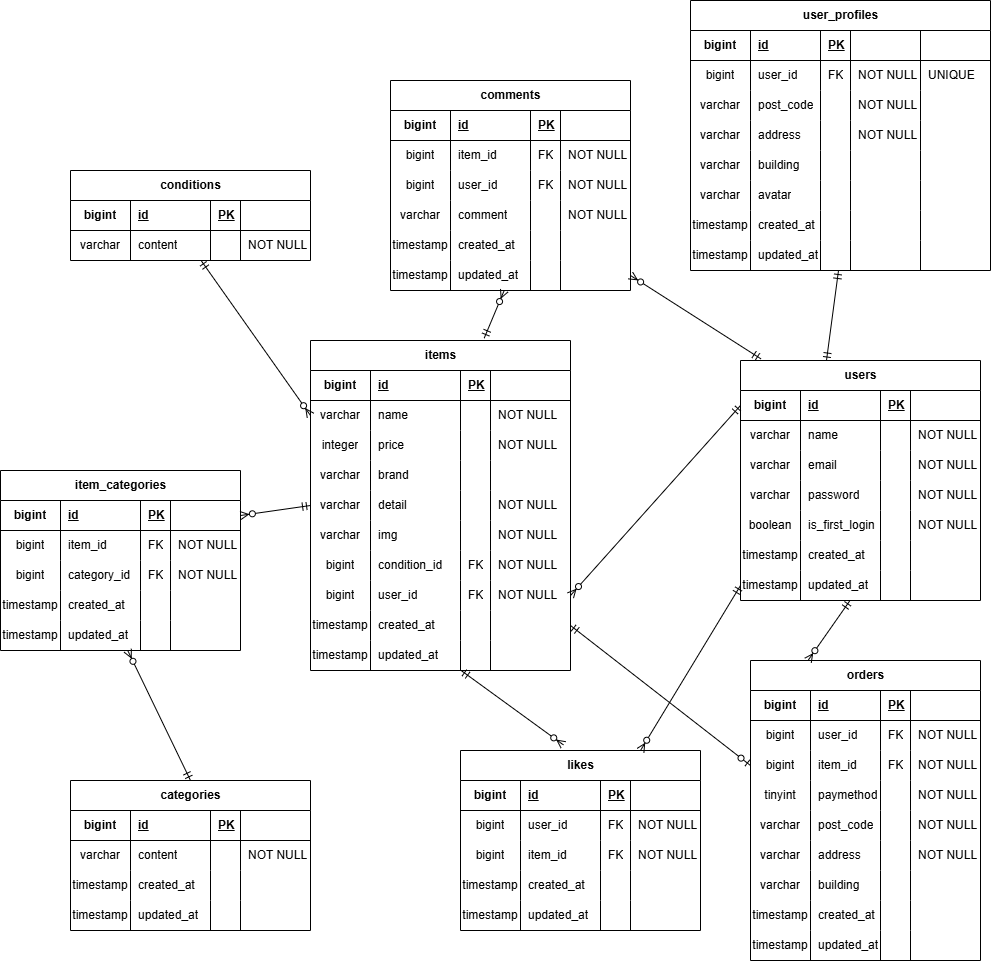

# アプリケーション名
coachtechフリマ

## 環境構築
### Dockerビルド
- git clone git@github.com:Shuta0105/coachtech-.git
- docker-compose up -d --build

### Laravel環境構築
- docker-compose exec php bash
- composer install
- cp .env.example .env
- php artisan key:generate
- php artisan migrate --seed

## 開発環境
- トップ画面：http://localhost/
- ユーザー登録：http://localhost/register
- phpMyAdmin：http://localhost:8080/

## 使用技術（実行環境）
- PHP 8.1-fpm
- Laravel 8.83.29
- MySQL 8.0.26
- nginx 1.21.1
- stripe 19.1.0

## ER図

